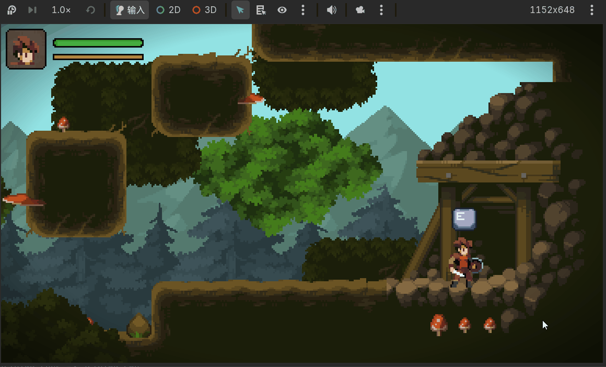
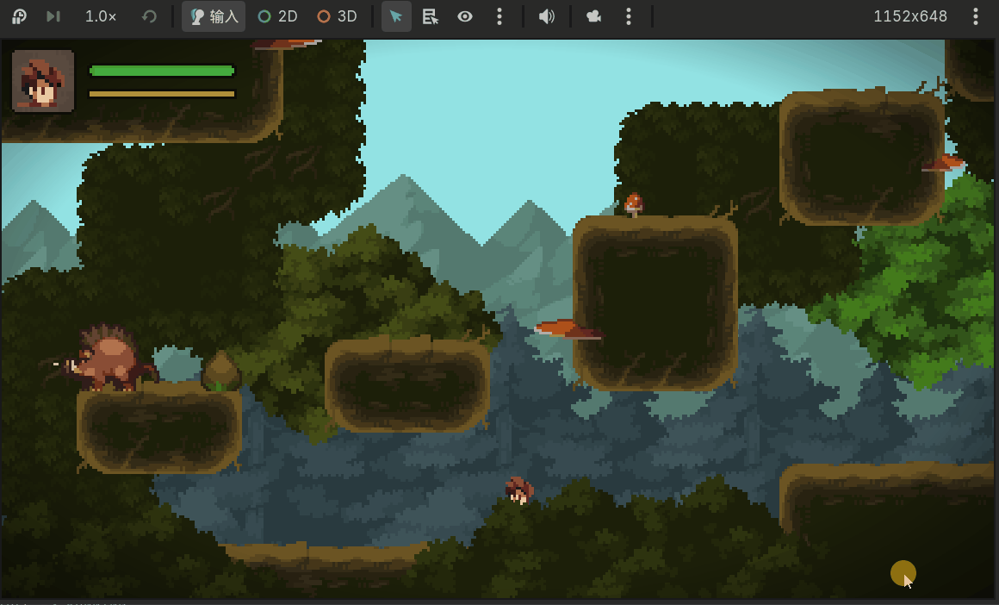
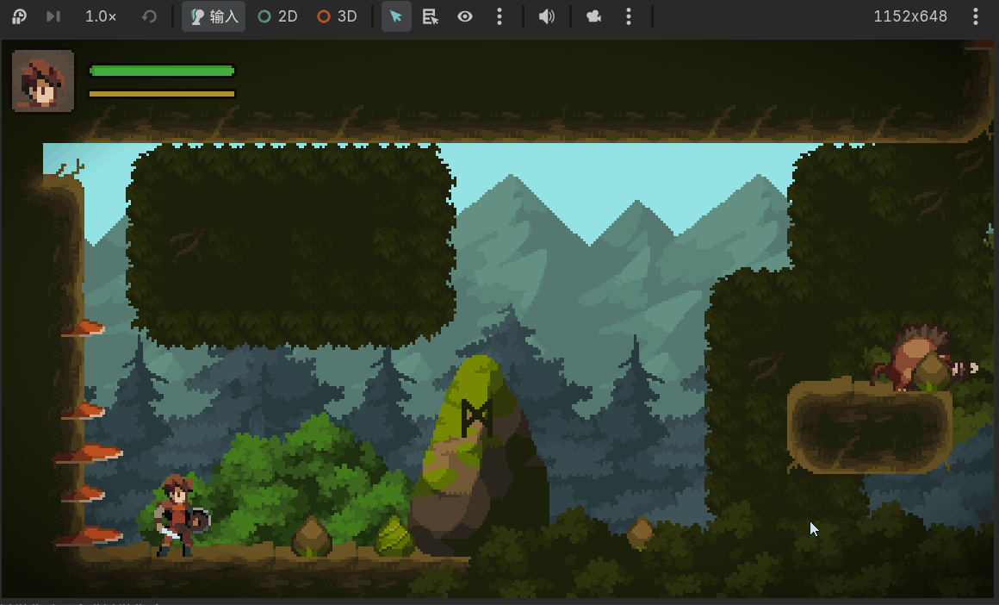

# Brave Legend

[English](./README.md) | [中文](./README_cn.md) | [日本語](./README_jp.md)

**Godot 4.7**（Forward+ レンダラー）で開発された 2D アクションプラットフォーマーのプロトタイプです。  
ステートマシン駆動の戦闘・被ダメージ/死亡ロジックに加えて、タイトル画面、セーブポイント、シーン遷移、ポーズ/エンディング画面、オーディオとゲームパッド対応まで、ゲーム周辺システム一式を実装しています。

## Tech Stack

| カテゴリ | 技術 | バージョン | 説明 |
| :--- | :--- | :--- | :--- |
| **ゲームエンジン** | Godot Engine | 4.7（Forward+） | 中核となるゲーム開発エンジン |
| **スクリプト言語** | GDScript | Godot 4.7 標準搭載 | エンジンネイティブのスクリプト言語 |
| **2D 物理エンジン** | Jolt Physics | Godot 標準搭載（3D 物理エンジンだが 2D も駆動） | キャラクターの移動・衝突・物理判定 |
| **タイルマップ** | TileMapLayer | Godot 4.x | 地形、前景/背景レイヤー |
| **視差背景** | Parallax2D | Godot 4.x | 多層スクロールの視差背景 |
| **グローバルシングルトン** | Autoload | Godot 4.x | `Game` / `SoundManager` / `Vignette` の3つの Autoload がフロー・オーディオ・画面演出を管理 |
| **セーブ形式** | JSON / ConfigFile | Godot 標準搭載 | ゲーム進行データ（`user://data.sav`）とオーディオ設定（`user://config.ini`） |
| **オーディオバス** | AudioServer Bus | `default_bus_layout.tres` | Master / SFX / BGM の3系統。音量調整と永続化に対応 |
| **入力デバイス** | Keyboard / Gamepad / Touch | Godot InputMap | キーボード＆マウス、ゲームパッド（振動フィードバック付き）、タッチスクリーン用バーチャルジョイスティックに対応 |
| **アート形式** | Aseprite | - | ピクセルアートのソースファイル（`.aseprite`）。連番 PNG として書き出し |
| **レンダリングドライバ** | Direct3D 12 | Windows | プロジェクトのレンダリングバックエンド（`rendering_device/driver.windows`） |

---

<!--ts-->
* [Brave Legend](#brave-legend)
    * [Tech Stack](#tech-stack)
    * [Getting Started](#getting-started)
    * [Control](#control)
    * [Architecture](#architecture)
        * [State Machine](#state-machine)
        * [HitBox / HurtBox Combat Detection](#hitbox--hurtbox-combat-detection)
        * [Stats System](#stats-system)
        * [Interactable System](#interactable-system)
        * [Global Autoload Singletons](#global-autoload-singletons)
    * [Core Systems](#core-systems)
        * [Player System](#player-system)
        * [Enemy AI System](#enemy-ai-system)
        * [Scene Transition and Save System](#scene-transition-and-save-system)
        * [Camera, Screen Effects and Hit-stop](#camera-screen-effects-and-hit-stop)
        * [Audio System](#audio-system)
        * [UI Flow](#ui-flow)
        * [Input Adaptation](#input-adaptation)
    * [Statement](#statement)
<!--te-->

## Getting Started

1. GitHub からプロジェクトをローカルにクローンする
2. Godot Engine でプロジェクトを開く（Godot 4.7 以上が必須）
3. Play ボタン（または F5）を押して実行する。デフォルトではタイトル画面から始まる

## Control

| 操作 | キーボード | ゲームパッド | 説明 |
| ---- | ---- | ---- | ------------------------ |
| 移動 | `A` / `D` | 左スティック / 十字キー | 左右移動 |
| ジャンプ | `Space`（長押し/離す） | `A` ボタン（Xbox 配列） | 早めに離すとジャンプの高さが短くなる（可変ジャンプ） |
| 攻撃 | `J` | `X` ボタン | 攻撃アニメーション再生中に再度押すとコンボにつながる（最大3段） |
| スライディング | `K` | 右スティック押し込み | 精力（エネルギー）を消費。エネルギー不足時や足元に地面が続く場合は発動不可 |
| インタラクト | `E` | `B` ボタン | セーブポイントやテレポーターなどのインタラクト可能なオブジェクトと関わる |
| ポーズ | `Esc` | `Start` ボタン | ポーズメニューの開閉 |
| 壁ジャンプ | 壁際 + `Space` | 壁際 + `A` ボタン | 壁スライディング中に発動 |

> タッチデバイスではバーチャルジョイスティック（`UI/virtual_joypad.tscn`）が表示され、ドラッグ距離が `move_left` / `move_right` の入力にマッピングされます。インタラクトのプロンプトアイコン（`interaction_icon.gd`）は直近に使用した入力デバイスに応じて、キーボードアイコンとゲームパッドアイコンを自動で切り替えます。

## Architecture

本プロジェクトは **汎用ステートマシン + HitBox/HurtBox 衝突判定 + グローバルシングルトン** の3層構造を採用しています。キャラクターの挙動はステートマシンが駆動し、戦闘判定は衝突ボックスシステムが処理し、シーンをまたぐセーブ/オーディオ/フロー制御はグローバルシングルトンが一括管理します。

### State Machine

`Classes/StateMachine.gd` は、具体的なステート列挙型から切り離された汎用の有限ステートマシンノードです。

- **契約駆動**：ステートマシン自体は具体的なステートが何かを知りません。毎物理フレーム `owner` の `get_next_state(state)` を呼んで遷移すべきか判断し、`owner.tick_physics(state, delta)` を呼んで現在のステートの物理挙動を実行します
- **遷移フック**：ステートが変化するたびに `owner.transition_state(from, to)` が自動的に呼ばれ、アニメーション再生やワンショットフラグのリセットなどに使われます
- **ループでの解決**：`_physics_process` は `while true` ループで `get_next_state` を解決し続けるため、同一フレーム内で複数回のステート遷移が可能です（例：着地した瞬間にそのまま攻撃へ移行）
- **ゼロカップリングでの再利用**：`Player`（`player.gd`）と `enemy` / `boar`（`Enemy/enemy.gd`、`Enemy/boar.gd`）はそれぞれ独立した `State` 列挙型を定義しつつ、まったく同じ `StateMachine` ノード型を共有します

**コアスニペット：**
```gdscript
var current_state: int = -1:
    set(v):
        owner.transition_state(current_state, v)
        current_state = v
        state_time = 0

func _physics_process(delta: float) -> void:
    while true:
        var next := owner.get_next_state(current_state) as int
        if next == KEEP_CURRENT:
            break
        current_state = next

    owner.tick_physics(current_state, delta)
    state_time += delta
```

---

### HitBox / HurtBox Combat Detection

`Area2D` のシグナルをベースにしたヒット判定システムです。

- **HitBox**：攻撃の衝突形状にアタッチされ、`area_entered` 時に相手の `HurtBox` へ `hurt` シグナルを発し、自身も `hit` シグナルを発します
- **HurtBox**：`hurt` シグナルを宣言するだけで、実際のダメージ処理はキャラクタースクリプトの `_on_hurt_box_hurt` コールバックが担当します
- **物理レイヤーの分離**：`PlayerHurtBox` / `EnemyHurtBox` を別々の衝突レイヤーに分けることで、プレイヤーと敵の被弾判定が誤って干渉しないようにしています
- **ダメージデータのカプセル化**：`Damage`（`RefCounted`）は `amount` と `source` のみを保持し、ヒットフレームで生成され、ステートが `HURT` に遷移する際に消費・クリアされます。これにより1回のヒットで1回だけダメージが発生することが保証されます
- **ヒットフィードバックの連動**：プレイヤーの `_on_hit_box_hit` コールバックは敵にヒットした瞬間に短いカメラシェイクとヒットストップを発生させます（詳細は[Camera, Screen Effects and Hit-stop](#camera-screen-effects-and-hit-stop)を参照）。被弾側が `HURT` に遷移すると、ゲームパッドの振動・カメラシェイク・無敵時間がトリガーされます

---

### Stats System

`Classes/Stats.gd` は体力と精力（エネルギー）を再利用可能な `Node` コンポーネントとしてまとめています。

- **プロパティ駆動のシグナル**：`health` / `energy` は setter 内で自動的に `[0, max]` にクランプされ、値が実際に変化したときのみ `health_changed` / `energy_changed` を発火します。これにより無意味な UI 更新を避けます
- **エネルギーの自動回復**：`_process` が `energy_regen` のレートでエネルギーを継続的に回復させ、スライディングなど消費系アクションに供給します
- **シリアライズ可能**：`to_dict()` / `from_dict()` により現在の体力と最大値を素のディクショナリとして書き出し/読み込みでき、セーブシステムがそのまま JSON へ落とし込めます
- **キャラクターと UI からの分離**：`Player`、`Stats`、UI はシグナルのみで通信し、ステータスパネルはキャラクターの内部状態を直接読みません。`Player` の `stats` プロパティはグローバルな `Game.player_stats` を直接参照しているため、シーン遷移をまたいでも体力が維持されます

---

### Interactable System

`Classes/Interactable.gd` は、セーブポイントやテレポーターなどのシーンオブジェクトが継承する共通基底クラスです。

- **検出専用のコリジョン**：`Interactable` 自身は `collision_layer`/`collision_mask` を設定せず、レイヤー2（`Player`）の `body_entered` / `body_exited` のみを監視します
- **インタラクトスタック**：プレイヤーが検出範囲に入ると `player.register_interactable(self)` が呼ばれ、自身がプレイヤーの `interacting_with` 配列に積まれます。範囲を出ると `unregister_interactable` で取り除かれます。プレイヤーがインタラクトキーを押すと配列の末尾（`.back()`）に対して `interact()` が実行されるため、複数のインタラクト対象が重なっていても直近に入ったものが優先的に反応します
- **拡張用の仮想メソッド**：デフォルトの `interact()` はログを出力し `interacted` シグナルを発するだけで、サブクラスは `super()` で親の処理を呼んだ後に独自の挙動を追加します
- **具体的な実装**：
  - `Teleporter`（テレポーター、例：`Objects/mine_gate.tscn`）：`interact()` 内で `Game.change_scene(path, {entry_point = entry_point})` を呼び、対象シーンへ遷移して指定の `EntryPoint` に位置合わせします
  - `save_stone`（セーブポイント、`Objects/save_stone.tscn`）：`interact()` 内で「点灯」アニメーションを再生し `Game.save_game()` を呼んでセーブデータを書き込みます
- **インタラクトプロンプトアイコン**：プレイヤーの頭上に表示される `InteractionIcon`（`interaction_icon.gd`）は `interacting_with` が空かどうかで表示・非表示を切り替え、キーボード/ゲームパッドのアイコンにも自動で対応します



---

### Global Autoload Singletons

3つの Autoload がシーンをまたぐグローバルな状態をつなぎ合わせています。

- **`Game`**（`Globals/game.gd`）：`player_stats`（グローバルな体力/エネルギー）を保持し、フェード付きシーン遷移、セーブ/ロード（JSON を `user://data.sav` にシリアライズ）、オーディオ設定の永続化（`ConfigFile` を `user://config.ini` に）、カメラシェイクを要求するシグナル `camera_should_shake` を管理します
- **`SoundManager`**（`Globals/sound_manager.gd`）：SFX 再生、BGM の切り替え（同じ曲の再生中は再スタートしない）、UI サウンドの自動アタッチ（ノードツリーを再帰的に走査して `Button` / `Slider` に効果音を紐付ける）、そしてバス音量のリニア値↔デシベル変換を一元管理します
- **`Vignette`**（`Vignette.gdshader` を実行する `CanvasLayer`）：`layer = 10` で最前面に常駐し、シェーダーによって画面端を暗くするビネット効果を演出します

## Core Systems

現在プロジェクトには以下のコアシステムが実装されています。

### Player System

`CharacterBody2D` を基盤とする `player.gd` は、フル機能のアクションプラットフォーマー用キャラクターコントローラーです。

- **ステート集合**：待機、走行、ジャンプ、落下、着地、壁スライディング、壁ジャンプ、3段攻撃コンボ、被ダメージ、死亡、スライディング（開始/ループ/終了）
- **コヨーテタイム**：地面を離れた後も `coyote_timer` により短時間はジャンプが可能
- **ジャンプバッファリング**：`jump_request_timer` がジャンプ入力をキャッシュし、早めに押していても着地した瞬間に反応する
- **可変ジャンプ高度**：上昇中にジャンプボタンを離すと上昇速度が打ち切られ、「軽く押せば小ジャンプ、長押しでフルジャンプ」という感触になる
- **壁検知と壁ジャンプ**：`HandChecker` / `FeetChecker` という2本の `RayCast2D` で壁スライディング可能かを判定し、壁ジャンプには専用の速度ベクトルと短い入力ロック時間がある
- **コンボ攻撃**：攻撃アニメーション再生中に再度攻撃キーを押すと `is_combo_requested` が立ち、アニメーション終了時にこれを見て次の段に進むか待機に戻るかを決める
- **スライディング**：エネルギーを消費し、時間制限（`SLIDING_DURATION`）付きでスライドする。足元に地面が続いている場合は発動できない
- **被ダメージと死亡**：被弾するとノックバックと無敵時間（`invincible_timer`）が発生し、同時にゲームパッド振動とカメラシェイクがトリガーされる。無敵時間中はスプライトが点滅する。体力が0になると死亡アニメーションを再生し、（シーンをそのままリロードするのではなく）「Game Over」画面がポップアップする
- **着地判定**：落下の開始高度と終了高度の差（`LANDING_HEIGHT`）によって、硬直のある「重い着地」アニメーションを再生するか、そのまま走行に移行するかを決める
- **インタラクトとポーズ**：インタラクトキーを押すと現在登録されているインタラクト対象を駆動し（[Interactable System](#interactable-system)参照）、ポーズキーを押すとポーズメニューが開く



### Enemy AI System

`Enemy/enemy.gd` が敵の基底クラスを提供し、`Enemy/boar.gd`（イノシシ）がその上に具体的な AI 挙動を実装しています。

- **基底クラスの共通機能**：移動（`move`）、向きの反転（`direction` が `graphics.scale.x` を駆動）、重力落下。`_ready` で自動的に `enemies` グループへ追加され、セーブシステムやレベルスクリプトから一括で参照できる
- **ステート集合**：待機、巡回歩行、追跡走行、被ダメージ、死亡
- **視界判定**：`PlayerChekcker` のレイキャストでプレイヤーが見えるかを判定し（`can_see_player`）、発見すると追跡ステートに切り替わる
- **環境認識によるターン**：`WallChekcker` / `FloorChekcker` が前方の壁や崖を検知してターンをトリガーし、マップ外へ歩いて行ったり壁に激突したりするのを防ぐ
- **クールダウンタイマー**：追跡中にプレイヤーを見失っても、`calm_down_timer` が切れるまでは巡回に戻らないため、頻繁なステート切り替えを避けられる
- **被ダメージと死亡**：プレイヤーと同じノックバック＋ダメージ処理パターンを共有するが、無敵時間はない。死亡時は `queue_free()` の前に `died` シグナルを発し、レベルスクリプト（`scene_2.gd` の `_on_boar_died` など）がこれを監視して後続の処理（例：一定時間後にエンディング画面へ遷移）をトリガーできる



### Scene Transition and Save System

すべて `Game.gd` によって駆動されるシーン遷移とセーブの永続化システムです。

- **フェード遷移**：`change_scene(path, params)` はまず `SceneTree` を一時停止し `Tween` で黒画面へフェードアウトします。`await` で完了を待ってから実際にシーンを切り替え、`SceneTree` の一時停止を解除し、最後にフェードインします。遷移中の `Tween` は `TWEEN_PAUSE_PROCESS` を使用しているため、一時停止中でも再生され続けます
- **入場ポイントの位置合わせ**：シーンに配置された `EntryPoint`（向きを持つ `Marker2D`）は `entry_points` グループに加わります。シーン遷移時には `entry_point` の名前で該当ノードを検索し、`World.update_player` を呼んでプレイヤーを正しい位置と向きに配置します
- **シーンごとの敵の生存状態の保存**：シーンを離れる前に現在の `World.to_dict()` が呼ばれ、`enemies` グループの中でまだ生きているノードのパスを `world_states` ディクショナリに記録します。同じシーンに再び入ると `from_dict()` が生存リストに含まれない敵を削除するため、「倒した敵は復活しない」という挙動が実現されます
- **セーブ / ロード**：`save_game()` は `world_states`、`player_stats.to_dict()`、現在のシーンパス、プレイヤーの位置/向きを JSON にシリアライズして `user://data.sav` に書き込みます。`load_game()` はそれを読み込み、`change_scene` の `init` コールバックを通じて `world_states` とキャラクターのステータスを注入します
- **ニューゲーム / タイトルへ戻る**：`new_game()` は `world_states` をクリアしキャラクターのステータスをリセットしてから `world.tscn` へ遷移します。`back_to_title()` はタイトル画面へ遷移します。どちらも同じ遷移ロジックを再利用しています


### Camera, Screen Effects and Hit-stop

- **カメラ境界のクランプ**：`world.gd` は `_ready` 内で `Geometry` レイヤーの `get_used_rect()` と `tile_size` からマップ四辺の座標を算出し、`Camera2D` の `limit_*` プロパティに設定することで、カメラがマップの外を映さないようにしています
- **スムージングのリセット**：ゲーム開始時やシーン遷移でプレイヤーがワープした際にカメラが滑るように移動して見えるのを防ぐため、`reset_smoothing()` を手動で呼んでいます
- **多層視差背景**：複数の `Parallax2D` ノード（空、丘など）にそれぞれ異なる `scroll_scale` を設定し、近くは速く・遠くは遅くスクロールする視差効果を実現しています
- **カメラシェイク**：`Camera2D` にアタッチされた `shakeCamera.gd` が `Game.camera_should_shake` シグナルを監視してシェイク強度を加算し、毎フレーム `recovery_speed` で減衰させながら `offset` をランダムにずらします。敵にヒットした場合（弱め）と自分が被弾した場合（強め）で異なる強度のシェイクが要求されます
- **ヒットストップ**：プレイヤーの `_on_hit_box_hit` が敵にヒットした瞬間、`Engine.time_scale` を `0.01` まで急落させ、短い遅延の後（`time_scale` の影響を受けないタイマーを使用）に `1` へ戻すことで、ヒットの瞬間に心地よい間を作り出します
- **ビネット効果**：グローバルな `Vignette` シングルトンが最前面のキャンバスレイヤーに常駐し、`Vignette.gdshader` によって画面周囲にグラデーションの暗さを重ねます

### Audio System

`Globals/sound_manager.gd` が3つのオーディオバス（`Master` / `SFX` / `BGM`）を一元管理します。

- **SFX 再生**：`play_sfx(name)` は `SFX` コンテナ配下からノード名で `AudioStreamPlayer` を検索して再生します。ジャンプ、攻撃、被ダメージ、UI 操作など様々な場面で呼ばれます
- **重複しない BGM 切り替え**：`play_bgm(stream)` は対象トラックが既に再生中であればそのままスキップし、同じ BGM が何度も再スタートするのを防ぎます
- **UI サウンドの自動アタッチ**：`setup_ui_sound(node)` はノードツリーを再帰的に走査し、`Button` にはプレス/フォーカス音を、`Slider` には値変化/フォーカス音を自動で紐付け、さらにマウスホバーでフォーカスを取得するようにして、ゲームパッド/キーボードのナビゲーションハイライトと同期させます
- **音量の永続化**：音量は UI と `ConfigFile` の間ではリニア値（0〜1）としてやり取りされ、内部ではデシベル（`AudioServer` のバス音量）との間で `db_to_linear` / `linear_to_db` によって変換されます。`Game.save_config` / `load_config` が `user://config.ini` の読み書きを担当します

### UI Flow

- **タイトル画面**（`title_screen.tscn`）：セーブデータの有無に応じて「ロードゲーム」ボタンの有効/無効を切り替え、タイトル BGM を再生し、すべてのボタンに UI サウンドを紐付けます
- **ポーズメニュー**（`pause_screen.tscn`）：`pause` / `ui_cancel` の入力で開閉し、`visibility_changed` シグナルが直接 `get_tree().paused` を駆動するため、追加の状態同期が不要です
- **Game Over 画面**（`game_over_screen.tscn`）：プレイヤーが死亡すると表示され、任意の入力（キーボード/マウス/ゲームパッド）で続行します。セーブデータがあればロードして再開し、なければタイトル画面へ戻ります
- **エンディング画面**（`game_end_screen.tscn`）：エンディングのテキストを1行ずつフェードイン/アウトで再生し、最後の行の後は任意の入力でタイトル画面へ戻ります
- **音量スライダー**（`volume_slider.gd`）：指定した `AudioServer` バスに紐付き、ドラッグするとリアルタイムで音量が変わり、即座に設定ファイルへ書き込まれます

### Input Adaptation

- **マルチデバイス入力マッピング**：`project.godot` の `[input]` セクションでは、各アクション（移動、ジャンプ、攻撃、スライディング、インタラクト、ポーズ）にキーボードキーとゲームパッドのボタン/スティックイベントの両方が設定されています
- **適応型プロンプトアイコン**：`Classes/interaction_icon.gd` は直近の入力イベントの種類を監視し、ゲームパッドのボタン押下/スティック傾倒を検知すると対応するゲームパッドアイコンのアニメーションに切り替え、キーボード/マウス入力を検知するとキーボードアイコンのアニメーションに戻します
- **タッチスクリーン用バーチャルジョイスティック**：`UI/virtual_joypad.tscn` と `UI/knob.gd`（`TouchScreenButton` を継承）が組み合わさり、ドラッグ範囲が制限されたバーチャルジョイスティックを実現します。ドラッグ方向は比率に応じて `move_left` / `move_right` の疑似入力値にマッピングされます
- **ゲームパッド振動フィードバック**：被弾時に `Input.start_joy_vibration` を呼んで短い振動を発生させ、被弾のフィードバックを強化します

## Statement

本プロジェクトは **Godot Engine 4.7** で開発されており、汎用ステートマシン + HitBox/HurtBox 衝突判定 + グローバルシングルトンのアーキテクチャを採用しています。  
2D アクションプラットフォーマー（メトロイドヴァニア / ARPG 系）の学習・プロトタイピングに適しています。

**アート・オーディオ素材について：**  
プロジェクト内の `Assets/Legacy-Fantasy - High Forest 2.3`、`Assets/generic_char_v0.2`、`Assets/gdb-gamepad-2(all)`、および `BGM/`、`SFX/` フォルダ内の音声ファイルはすべてサードパーティ製の素材であり、本プロジェクトの学習・効果デモンストレーションのみを目的として使用しています。  
`generic_char_v0.2` パックの作者連絡先はパック内の `readme.TXT` に記載されています（E-Mail: brullov.ad@gmail.com、Twitter: @brullov_art）。そのライセンスでは、無料・商用問わず利用および改変が許可されていますが、再配布・再販売、および印刷物など物理的な製品への使用は禁止されています。  
その他のサードパーティ素材（アート、音楽、効果音、操作プロンプトアイコン）の著作権はそれぞれの原作者に帰属し、本リポジトリには対応するライセンスファイルは同梱されていません。本プロジェクトのサードパーティ素材を商用目的や著作権者の利益を損なう形で使用しないでください。使用する場合は必ずご自身でライセンスを確認し、原作者から許諾を得てください。
